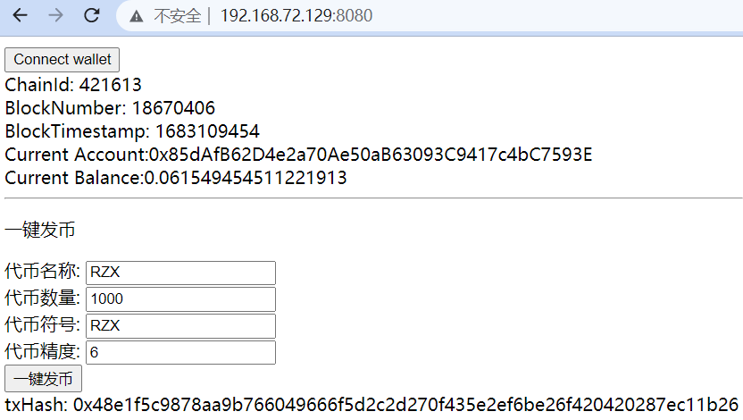
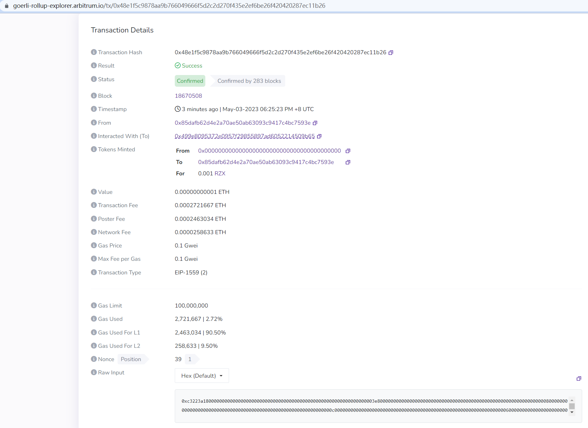
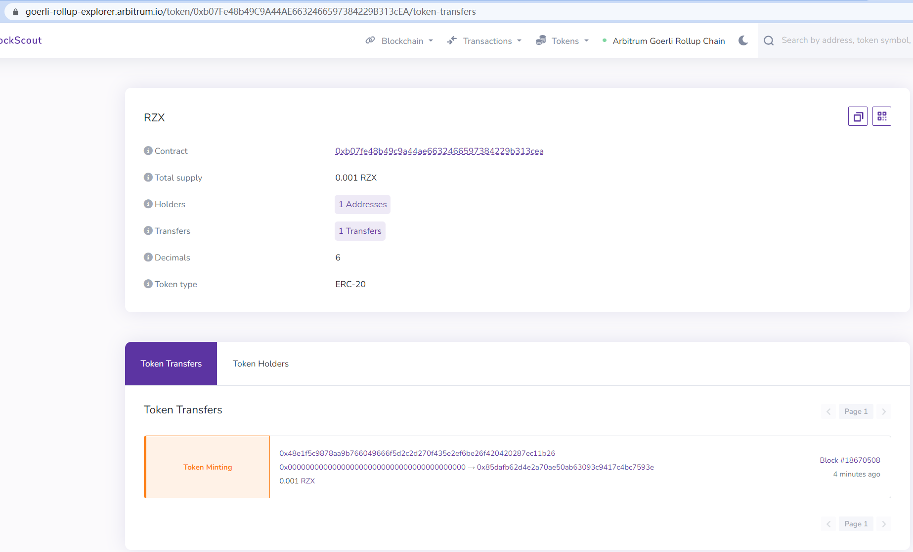

# hw07：


## 合约部署&验证命令

```bash
$ npx hardhat --network arbgoerli run scripts/deploy.js 
Address deploying the contract --> 0x85dAfB62D4e2a70Ae50aB63093C9417c4bC7593E
Clone contract address --> 0x34A5e88B92B18E4792ae0128d9E92a7b13FC7751
ERC20Template contract address --> 0x438A4FA4f1Ac7e54d89946aE5609027E9Ea01633
ERC20V3Factory contract address --> 0x499e8095372e0957f29855897Ad6052214509b65

Successfully submitted source code for contract
contracts/InitializableERC20.sol:InitializableERC20 at 0x438A4FA4f1Ac7e54d89946aE5609027E9Ea01633
for verification on the block explorer. Waiting for verification result...

Successfully submitted source code for contract
contracts/ERC20V3Factory.sol:ERC20V3Factory at 0x499e8095372e0957f29855897Ad6052214509b65
for verification on the block explorer. Waiting for verification result...

Successfully submitted source code for contract
contracts/ERC20V3Factory.sol:CloneFactory at 0x34A5e88B92B18E4792ae0128d9E92a7b13FC7751
for verification on the block explorer. Waiting for verification result...

Successfully verified contract InitializableERC20 on Etherscan.
https://goerli.arbiscan.io/address/0x438A4FA4f1Ac7e54d89946aE5609027E9Ea01633#code

Successfully verified contract ERC20V3Factory on Etherscan.
https://goerli.arbiscan.io/address/0x499e8095372e0957f29855897Ad6052214509b65#code

Successfully verified contract CloneFactory on Etherscan.
https://goerli.arbiscan.io/address/0x34A5e88B92B18E4792ae0128d9E92a7b13FC7751#code
```

## 已验证合约代码

- **模板合约**

https://goerli.arbiscan.io/address/0x438A4FA4f1Ac7e54d89946aE5609027E9Ea01633#code

- **ERC20工厂合约**

https://goerli.arbiscan.io/address/0x499e8095372e0957f29855897Ad6052214509b65#code

- **克隆工厂合约**

https://goerli.arbiscan.io/address/0x34A5e88B92B18E4792ae0128d9E92a7b13FC7751#code


## 一键发币

- **发币操作截图**



- **发币交易**

https://goerli-rollup-explorer.arbitrum.io/tx/0x48e1f5c9878aa9b766049666f5d2c2d270f435e2ef6be26f420420287ec11b26



- **代币合约**

https://goerli-rollup-explorer.arbitrum.io/token/0xb07Fe48b49C9A44AE6632466597384229B313cEA/token-transfers

