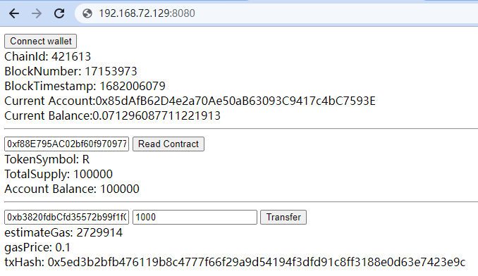
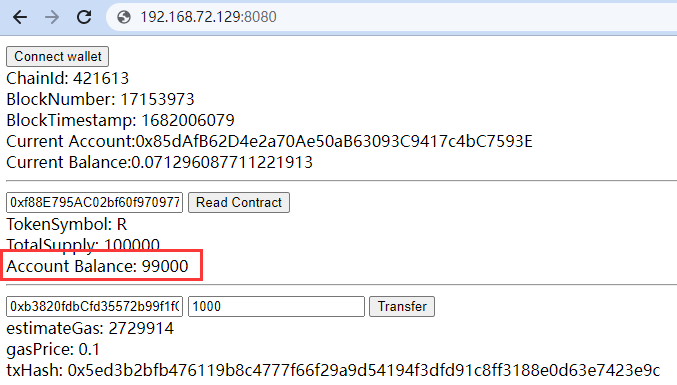

# hw06

## 合约部署

```bash
$ npx hardhat --network arbgoerli run scripts/deploy.js 
Address deploying the contract --> 0x85dAfB62D4e2a70Ae50aB63093C9417c4bC7593E
Token contract address --> 0xf88E795AC02bf60f970977241C7Fda3e55C306a2
```

合约地址：https://goerli.arbiscan.io/address/0xf88E795AC02bf60f970977241C7Fda3e55C306a2

## 转账过程

- **转账前**



- **转账后**




## 作业1：部署带有增发与销毁功能的erc20合约至测试网


## 作业2：开发前端界面，合约owner可以在前端实现增发与销毁功能


## 作业3：前端可读取当前合约的最新状态（totalSupply），可读取输入的账户地址当前余额

