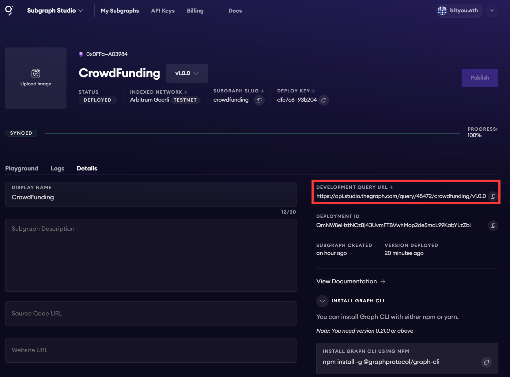
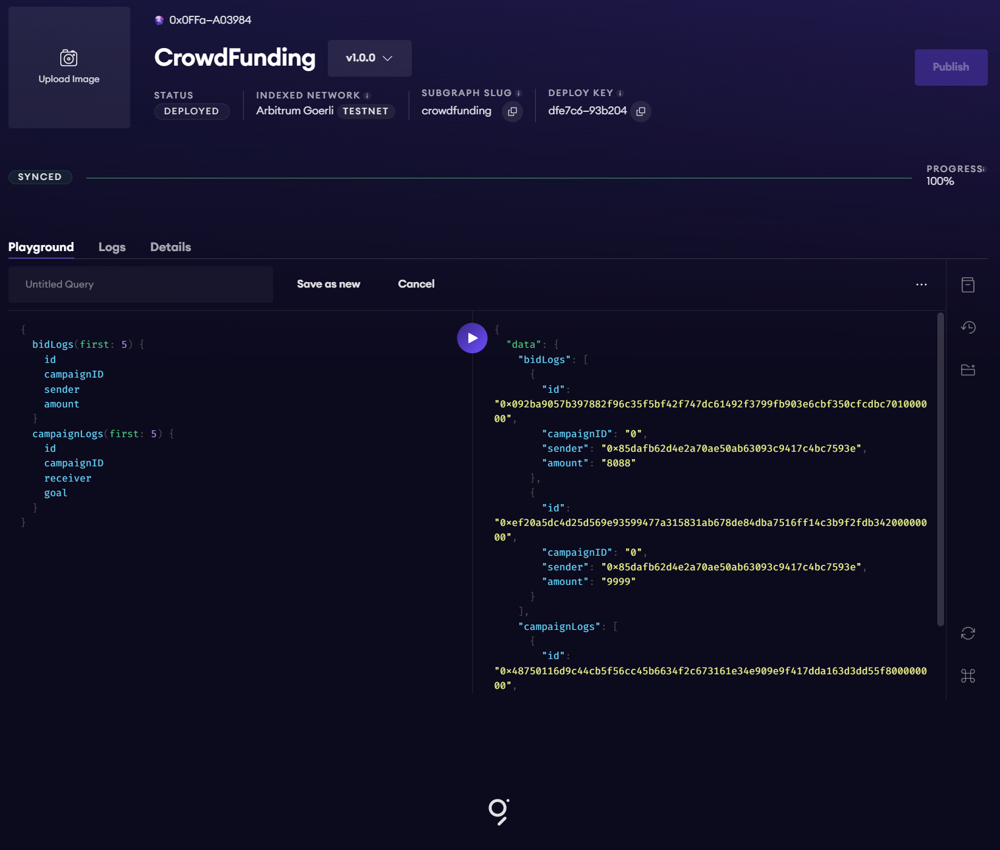

# 链上数据记录与检索

##　合约部署

```bash
$ npx hardhat --network arbgoerli run scripts/deploy.js 
Compiled 1 Solidity file successfully
Address deploying the contract --> 0x85dAfB62D4e2a70Ae50aB63093C9417c4bC7593E
Token contract address --> 0xefb47fCC4FEE6C73B6C9B8E5b465b520F5c7BD43
```

## 初始化

```bash
$ graph init --studio crowdfunding
✔ Protocol · ethereum
✔ Subgraph slug · crowdfunding
✔ Directory to create the subgraph in · crowdfunding
✔ Ethereum network · arbitrum-goerli
✔ Contract address · 0xefb47fCC4FEE6C73B6C9B8E5b465b520F5c7BD43
✖ Failed to fetch ABI from Etherscan: ABI not found, try loading it from a local file
✔ Fetching Start Block
✔ ABI file (path) · ./CrowdFundingEvent.json
✔ Start Block · 16450552
✔ Contract Name · CrowdFundingEvent
✔ Index contract events as entities (Y/n) · true
  Generate subgraph
  Write subgraph to directory
✔ Create subgraph scaffold
✔ Initialize networks config
✔ Initialize subgraph repository
✔ Install dependencies with yarn
✔ Generate ABI and schema types with yarn codegen
Add another contract? (y/n): 
Subgraph crowdfunding created in crowdfunding

Next steps:

  1. Run `graph auth` to authenticate with your deploy key.

  2. Type `cd crowdfunding` to enter the subgraph.

  3. Run `yarn deploy` to deploy the subgraph.

Make sure to visit the documentation on https://thegraph.com/docs/ for further information.

```

## 授权

```
graph auth --studio dfe7....b204
Deploy key set for https://api.studio.thegraph.com/deploy/
```

## 编译

```bash
$ graph codegen && graph build
  Skip migration: Bump mapping apiVersion from 0.0.1 to 0.0.2
  Skip migration: Bump mapping apiVersion from 0.0.2 to 0.0.3
  Skip migration: Bump mapping apiVersion from 0.0.3 to 0.0.4
  Skip migration: Bump mapping apiVersion from 0.0.4 to 0.0.5
  Skip migration: Bump mapping apiVersion from 0.0.5 to 0.0.6
  Skip migration: Bump manifest specVersion from 0.0.1 to 0.0.2
  Skip migration: Bump manifest specVersion from 0.0.2 to 0.0.4
✔ Apply migrations
✔ Load subgraph from subgraph.yaml
  Load contract ABI from abis/CrowdFundingEvent.json
✔ Load contract ABIs
  Generate types for contract ABI: CrowdFundingEvent (abis/CrowdFundingEvent.json)
  Write types to generated/CrowdFundingEvent/CrowdFundingEvent.ts
✔ Generate types for contract ABIs
✔ Generate types for data source templates
✔ Load data source template ABIs
✔ Generate types for data source template ABIs
✔ Load GraphQL schema from schema.graphql
  Write types to generated/schema.ts
✔ Generate types for GraphQL schema

Types generated successfully

  Skip migration: Bump mapping apiVersion from 0.0.1 to 0.0.2
  Skip migration: Bump mapping apiVersion from 0.0.2 to 0.0.3
  Skip migration: Bump mapping apiVersion from 0.0.3 to 0.0.4
  Skip migration: Bump mapping apiVersion from 0.0.4 to 0.0.5
  Skip migration: Bump mapping apiVersion from 0.0.5 to 0.0.6
  Skip migration: Bump manifest specVersion from 0.0.1 to 0.0.2
  Skip migration: Bump manifest specVersion from 0.0.2 to 0.0.4
✔ Apply migrations
✔ Load subgraph from subgraph.yaml
  Compile data source: CrowdFundingEvent => build/CrowdFundingEvent/CrowdFundingEvent.wasm
✔ Compile subgraph
  Copy schema file build/schema.graphql
  Write subgraph file build/CrowdFundingEvent/abis/CrowdFundingEvent.json
  Write subgraph manifest build/subgraph.yaml
✔ Write compiled subgraph to build/

Build completed: build/subgraph.yaml

```

## 部署

```bash
$ graph deploy --studio crowdfunding
Which version label to use? (e.g. "v0.0.1"): 
Which version label to use? (e.g. "v0.0.1"): v1.0.0
  Skip migration: Bump mapping apiVersion from 0.0.1 to 0.0.2
  Skip migration: Bump mapping apiVersion from 0.0.2 to 0.0.3
  Skip migration: Bump mapping apiVersion from 0.0.3 to 0.0.4
  Skip migration: Bump mapping apiVersion from 0.0.4 to 0.0.5
  Skip migration: Bump mapping apiVersion from 0.0.5 to 0.0.6
  Skip migration: Bump manifest specVersion from 0.0.1 to 0.0.2
  Skip migration: Bump manifest specVersion from 0.0.2 to 0.0.4
✔ Apply migrations
✔ Load subgraph from subgraph.yaml
  Compile data source: CrowdFundingEvent => build/CrowdFundingEvent/CrowdFundingEvent.wasm
✔ Compile subgraph
  Copy schema file build/schema.graphql
  Write subgraph file build/CrowdFundingEvent/abis/CrowdFundingEvent.json
  Write subgraph manifest build/subgraph.yaml
✔ Write compiled subgraph to build/
  Add file to IPFS build/schema.graphql
⠋ Upload subgraph to IPFS(node:18560) ExperimentalWarning: The Fetch API is an experimental feature. This feature could change at any time
(Use `node --trace-warnings ...` to show where the warning was created)
                .. QmYQnkqvpLZT2AmAe8XTJTUcK7UNEMvFFbrf8u5ZYs3FDs
  Add file to IPFS build/CrowdFundingEvent/abis/CrowdFundingEvent.json
                .. QmTEeB4yHhJCfTgp4LrrNi6BbgGsWgUG4VzbGx6ed9AHcA
  Add file to IPFS build/CrowdFundingEvent/CrowdFundingEvent.wasm
                .. Qmf4PRHdVz6N7AtqA8hfCSE1FzBsCzndKUkJj6tHb87qC1
✔ Upload subgraph to IPFS

Build completed: QmNW8eHztNCzBj43UvmFTBVwhMop2de5mcL99KabYLzZbi

Deployed to https://thegraph.com/studio/subgraph/crowdfunding

Subgraph endpoints:
Queries (HTTP):     https://api.studio.thegraph.com/query/45472/crowdfunding/v1.0.0
```

## 同步完成



## bid事件的索引


